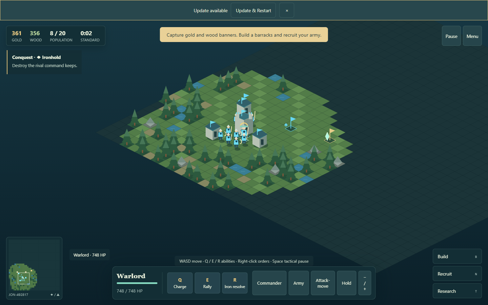

# Frontier Command

A playable offline fantasy RTS vertical slice. Lead a visible commander, capture an economy, raise a settlement, and command an army across an isometric frontier.



## Play now

On Windows, double-click **PLAY.cmd**. It serves the included production build and opens `http://127.0.0.1:4180/frontier-command/`. Node.js 22.12+ or 24 is required; the launcher also recognizes this machine's bundled Codex Node runtime. Do not open `dist/index.html` as a file: ES modules and service workers require HTTP.

Alternatively:

```sh
node scripts/serve.mjs
```

Open the displayed address. Load once online, then the production PWA can reload offline. Install with your browser's Install app / Add to Home Screen command. Saves live in your browser, separately for each origin; localhost saves do not automatically move to GitHub Pages.

## Included slice

- **Rush Arena:** a separate single-player survival skirmish with four commander squads, a closing safe zone, finite supply caches, telegraphed strikes, upgrade choices and instant retries. Launch it from the main menu or an RTS battle; return without changing that battle.
- Five switchable visual worlds in Toon and Realistic, themed backgrounds, exact expanded art where ready, faction shapes, and ambient/combat scores. See [theme integration](docs/THEME_INTEGRATION.md) and the [asset production contract](docs/THEME_ASSET_SPEC.md).
- Three factions with health, speed, cost, or income distinctions; three commanders with three abilities each.
- Six unit roles with counters and healing; eleven building definitions; six prerequisite-based technologies.
- Gold/wood capture economy, population, construction, recruitment queues, rally points, attack/move/hold/group orders.
- Four biomes, five map sizes, reproducible seeds, configurable terrain, competitive symmetry for two players, and connectivity validation.
- Six AI personalities with difficulty-dependent planning intervals. No AI income bonuses.
- Conquest, Domination, Relic Hunt, Survival; escalating relic income and a late territory/army adjudication to end stalemates.
- Five authored campaign missions, a campaign registry, structured triggers/actions, and a branching five-stage expedition with persistent rewards.
- Visual map editor with terrain/entities/spawns/resources/relics/camps, save/load/clone/import/export/validation/playtest.
- 24 achievements, renown, expedition relic choices, campaign progress, statistics, manual saves and 30-second autosaves.
- Finite gold mines and timber groves with reserve bars, depletion notices and persistent exhausted sites. Captured deposits harvest automatically; nearby depots speed harvesting. Keeps retain modest income so an exhausted deposit cannot permanently strand a player.
- A four-minute day/night lighting cycle with readable troops, building lights and a phase indicator. Lighting follows simulation time and freezes during tactical pause.
- Fog of war, minimap, hit/projectile/spell feedback, synthesized adaptive music/SFX, touch controls and accessibility settings.
- Offline PWA, explicit safe updates, versioned data, `/frontier-command/` build, GitHub Actions deployment.

## Controls

WASD / arrows move your commander. Q/E/R activate abilities. Tap friendly units to select; Shift-tap adds units; drag a box for group selection. Right-click or tap terrain to move selected units; tap enemies to attack. **Army** selects all troops. **Attack-move** switches the next terrain order. **Hold** prevents pursuit. Right-click with a production building selected sets its rally point. Ctrl+1–5 stores groups; 1–5 recalls them.

Space / Pause freezes simulation but allows inspection and queued orders. Normal and Easy allow unlimited pauses, Hard allows three, Brutal disables tactical pause. The Council menu pauses on all difficulties. B/N/T open Build/Recruit/Research. Middle-drag pans; touch-drag pans; wheel or ± zooms; minimap taps reposition the camera; Commander/Home restores follow. F2 opens development tools. Phone controls include a directional pad.

## Develop and test

Install Node.js 24 and pnpm 11.25.0. Use the committed lockfile.

```sh
pnpm install --frozen-lockfile
pnpm dev
pnpm lint
pnpm typecheck
pnpm test
pnpm balance
pnpm build
pnpm exec playwright install chromium
pnpm test:browser
pnpm preview
```

Browser tests serve the production build on port 4180. To use an installed Chromium browser instead of downloading one, set `FRONTIER_BROWSER` to its executable path. Development runs at `http://127.0.0.1:4173/frontier-command/`; its service worker is disabled. Production preview defaults to 4173; the standalone launcher and automated suite use 4180. If 4173 is occupied, Vite displays the actual available port. Offline testing must use production.

Unit/simulation tests cover combat, economy, recruitment, upgrades, pause, generation, 200+ seeded-map invariants, campaigns, victory, save migration and deterministic replay after restoring. Browser tests cover desktop and phone viewports, commander movement, recruitment, pause, save/load, campaign, editor, settings, subdirectory paths and offline reload/new games. `pnpm balance` emits reproducible AI-match metrics as JSON lines.

## GitHub Pages

Create or use the repository **kjljon/frontier-command**, push this project at repository root to `main`, and select **GitHub Actions** under Settings → Pages. `.github/workflows/pages.yml` installs, tests, builds, runs browser checks, and deploys `dist`. The canonical address is `https://kjljon.github.io/frontier-command/`. The source, manifest, generated worker, asset references and navigation all use that base path. This package includes the deployment configuration; it has not been published to the user's GitHub account from this environment.

## Extend the game

- Campaigns: [CREATING_CAMPAIGNS](docs/CREATING_CAMPAIGNS.md). Add a typed definition and register it in `src/campaigns.ts`; missions use validated structured triggers, never arbitrary scripts.
- Units/factions: [CREATING_UNITS_AND_FACTIONS](docs/CREATING_UNITS_AND_FACTIONS.md). Add definitions in `src/content.ts`, including production prerequisites and stat modifiers.
- Biomes: add a palette/terrain-rule definition in `src/content.ts`; setup and renderer discover it automatically. See [MAP_GENERATION](docs/MAP_GENERATION.md).
- Multiplayer: [MULTIPLAYER_ARCHITECTURE](docs/MULTIPLAYER_ARCHITECTURE.md). A future authoritative Worker/Durable Object supplies ordered commands/snapshots to the same simulation.
- PWA lifecycle: [PWA_AND_OFFLINE](docs/PWA_AND_OFFLINE.md). New workers wait; the player chooses Update & Restart; current state saves before activation. Cache cleanup never touches IndexedDB.

## Scope and next work

This is a working vertical slice, not a finished commercial RTS. Visuals are stylized procedural geometry. Local simulation uses reproducible fixed steps but is not cross-engine bit-exact lockstep. AI is a practical rule planner, pathfinding uses per-order grid BFS, and units have loose destination formations without collision avoidance. Competitive two-player maps have exact rotational terrain symmetry; larger competitive games use equal starting resources/radial layouts without tournament-grade fairness. Naval play, editable story triggers in the visual editor, full faction-exclusive rosters, replay playback and online multiplayer remain future work.

Quick/Standard/Epic tune map size, income, population, survival schedule and the escalation cutoff. Actual victory can occur much sooner with an aggressive strategy; an 18-minute Standard target is not a guaranteed duration. The highest-value improvements are observed human playtests for Standard pacing, shared flow-field movement/spatial indexing for large armies, richer commander attack animations, and more mission-specific authored layouts. Phone usability was checked in Chromium emulation; real-device/Safari testing is still needed.

See [ARCHITECTURE](docs/ARCHITECTURE.md), [LEVEL_EDITOR](docs/LEVEL_EDITOR.md), [VERIFICATION](docs/VERIFICATION.md) and [ASSETS](ASSETS.md).
